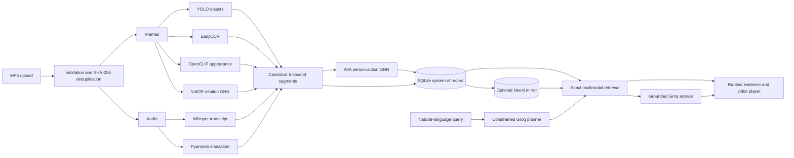

# VidQuery

VidQuery is an evidence-backed multimodal video search system. It turns an MP4
into timestamp-aligned evidence - speech, speakers, OCR, objects, appearance,
actions, and explicit subject-predicate-object relationships - then returns the
most relevant moments with playable timestamp citations.

This repository is the capstone implementation, not a mock interface. The
default local path uses SQLite for reliable application state and retrieval;
Neo4j is an optional graph mirror and explicit graph-search backend. Learned
models are activated only when a compatible, checksum-validated checkpoint is
present. Random GNN weights are never used for inference.

## What VidQuery can search

- spoken concepts and semantic transcript matches;
- Pyannote speaker labels such as `SPEAKER_01`;
- YOLO object classes and OpenCLIP appearance descriptions;
- EasyOCR text visible in frames;
- person-centric AVA actions from an 80-label action GNN;
- explicit VidOR subject-predicate-object relations from a 50-predicate GNN;
- geometry relations such as `near`, `left_of`, `above`, and `inside`;
- combinations such as "deployment while a laptop is visible";
- grounded answers synthesized from retrieved evidence, with clickable video
  timestamps.

Examples:

```text
Find where architecture is discussed
Find a person near a laptop
Find where SPEAKER_01 discusses deployment
Find the person in the blue jacket
Find a person talking to another person
```

## Architecture



Groq never queries Neo4j and never produces executable Cypher. The optional
planner emits a validated retrieval plan; the answer layer receives only the
top retrieved evidence and must cite valid evidence IDs. If Groq is unavailable,
normal ranked search continues to work.

## Implemented components

| Layer | Implementation |
|---|---|
| Media | streamed MP4 upload, `ffprobe` validation, SHA-256 deduplication, frame/audio extraction, range playback |
| Vision | YOLO detections, EasyOCR, OpenCLIP crop/frame embeddings, short-range tracks |
| Speech | timestamped Whisper transcription and compulsory Pyannote diarization for audio-bearing uploads |
| Actions | trained 80-label PyTorch Geometric AVA GATv2, person-node multilabel output |
| Relations | geometry tuples plus trained 50-predicate VidOR pair-visual GATv2 |
| Index | timestamp-aligned canonical segments in SQLite; idempotent optional Neo4j mirror |
| Retrieval | lexical + MiniLM semantic + entity + action + OCR + appearance + exact relation-tuple scoring |
| Answering | constrained Groq query planning and grounded JSON answer synthesis with timestamp citations |
| Product | FastAPI, packaged browser UI, upload/library/search flows, health and processing metadata |

AVA labels are person-centric actions. The AVA GNN does **not** predict object
targets. When an action needs a target, a separate compatible-entity resolver
creates the tuple with provenance `gnn_action_plus_target_resolver`. The VidOR
model is the component that directly predicts ordered visual relations.

## Quick start

Requirements:

- Python 3.11 or 3.12;
- FFmpeg/ffprobe on `PATH` (or the `imageio-ffmpeg` fallback);
- sufficient disk space for extracted media and local model caches;
- a Hugging Face token accepted for the configured Pyannote model when
  processing audio;
- Docker only if Neo4j is required.

```powershell
git clone https://github.com/Aryamanseven/VidQuery.git
Set-Location VidQuery
python -m venv .venv
.\.venv\Scripts\Activate.ps1
python -m pip install --upgrade pip
python -m pip install -e ".[dev,full]"
Copy-Item .env.example .env
python -m vidquery serve --host 127.0.0.1 --port 8000
```

Open <http://127.0.0.1:8000>. OpenAPI documentation is available at
<http://127.0.0.1:8000/docs>.

On macOS/Linux, use `source .venv/bin/activate` and `cp .env.example .env`.

### Configure models and credentials

Edit the local `.env`; never commit it. At minimum, review:

```dotenv
HUGGINGFACE_TOKEN=
GROQ_API_KEY=
NEO4J_PASSWORD=change-me
ALLOW_MODEL_DOWNLOADS=false
HF_HUB_OFFLINE=1
```

Use `ALLOW_MODEL_DOWNLOADS=true` and `HF_HUB_OFFLINE=0` only for an explicitly
authorized first download, then return to cached/offline operation. The complete
configuration contract, including model versions and thresholds, is in
[`.env.example`](.env.example).

### Model and checkpoint setup

Model weights, downloaded datasets, extracted media, and feature caches are
intentionally excluded from Git. Put locally produced artifacts at the paths in
`.env`, or change the corresponding settings.

| Component | Default local artifact/configuration |
|---|---|
| YOLO | `YOLO_MODEL=yolov8n.pt` |
| Whisper | `WHISPER_MODEL=tiny`, cached below `data/app/models/whisper` |
| Pyannote | `pyannote/speaker-diarization-3.1`, local Hugging Face cache |
| MiniLM | `sentence-transformers/all-MiniLM-L6-v2` |
| OpenCLIP | `ViT-B-32:openai`, cached below `data/app/models/appearance` |
| AVA GNN | `data/app/models/ava80_scaling/30/ablations/ava80-gat-v5-scale30-roi-frame.pt` plus matching metadata |
| VidOR GNN | `data/app/models/vidor_relation_pair_visual/vidor-relation-pair-visual-gat-v2.pt` plus matching metadata |

Missing, corrupt, checksum-mismatched, feature-incompatible, or version-
incompatible learned checkpoints are rejected visibly. Training commands and
artifact schemas are documented in [AVA80_GNN.md](docs/AVA80_GNN.md) and
[VIDOR_RELATION_FINAL_PASS.md](docs/VIDOR_RELATION_FINAL_PASS.md).

## Process and search a video

After models and `.env` are ready:

```powershell
python -m vidquery process --video C:\path\to\video.mp4 --copy
python -m vidquery search "person near a car" --limit 5
python -m vidquery serve --host 127.0.0.1 --port 8000
```

Check readiness at `GET /api/health`. For a trustworthy full run, YOLO and
Whisper should report `available_configured`, required diarization should be
available, and enabled learned models should report validated/compatible states.
Changing model configuration does not update existing indexed segments; use the
Library reprocess action or:

```powershell
python -m vidquery refresh-library
python -m vidquery refresh-library --video-id VIDEO_UUID
```

The pipeline is fail-soft at optional adapters. Required media extraction and
required diarization failures mark processing as failed with a safe public
message and a private diagnostic traceback.

## Neo4j and Docker

SQLite remains authoritative for videos, jobs, canonical evidence, paths,
playback metadata, and default search. Neo4j provides an optional idempotent
mirror for explicit, static, parameterized graph retrieval.

```powershell
$env:NEO4J_PASSWORD = "choose-a-strong-local-password"
docker compose up -d neo4j
docker compose up -d --build backend
docker compose ps
```

The tested stack uses Neo4j 5.26 Community, persistent named volumes, health
checks, and the FastAPI-hosted frontend. See
[NEO4J_VERIFICATION.md](docs/NEO4J_VERIFICATION.md) for schema counts,
idempotency evidence, saved parameterized Cypher examples, restart verification,
and the exact SQLite/Neo4j responsibility boundary.

## API surface

| Endpoint | Purpose |
|---|---|
| `POST /api/videos` | validate, stream, register, and queue an MP4 |
| `GET /api/videos` | list the persistent video library |
| `GET /api/videos/{id}/status` | processing state, warnings, and model provenance |
| `POST /api/videos/{id}/process` | retry or reprocess a video |
| `POST /api/search` | ranked evidence, optional grounded answer, and exact citations |
| `GET /api/videos/{id}/stream` | byte-range MP4 playback |
| `GET /api/videos/{id}/thumbnail` | nearest extracted frame |
| `GET /api/health` | SQLite, Neo4j, retrieval, and model readiness |

The search response keeps raw ranked results visible even when a grounded answer
is present. Every accepted answer citation maps back to an exact result video,
start time, and end time.

## Measured results

### Independent retrieval benchmark

The final corpus contains 62 manually specified queries over five videos: 52
positive and 10 negative queries across transcript, visual entity, spatial
relation, AVA action, speaker, multimodal, OCR, and negative categories. It has
zero overlap with AVA training/validation videos; the action portion uses one
strict held-out test video.

| Method | P@1 | P@5 | Recall@5 | MRR | Negative rejection |
|---|---:|---:|---:|---:|---:|
| Transcript lexical | 0.4231 | 0.0885 | 0.3462 | 0.4231 | 0.9000 |
| Transcript MiniLM | 0.5000 | 0.1885 | 0.4692 | 0.5000 | 0.3000 |
| Visual entity | 0.3462 | 0.3500 | 0.3617 | 0.4109 | 0.9000 |
| Hybrid without exact tuples | 0.9615 | 0.5692 | 0.7706 | 0.9615 | 0.9000 |
| Exact local hybrid | 0.9615 | 0.5769 | 0.7738 | 0.9615 | 0.9000 |
| Exact Neo4j graph | 0.8654 | 0.5462 | 0.6776 | 0.8654 | 1.0000 |
| AVA GNN-enhanced, supported 14-query subset | 0.5000 | 0.3714 | 0.2181 | 0.5000 | n/a |

Exact tuples improved spatial P@5 from 0.95 to 1.00 and spatial Recall@5 from
0.6553 to 0.6757, while spatial P@1/MRR tied the ablation. These are capstone-
scale results, not broad-domain superiority claims. Full per-category/per-video
metrics and raw rankings are in
[EVALUATION_FINAL.md](docs/EVALUATION_FINAL.md) and
`evaluation/results/independent-final.json`.

### Learned model results

| Model | Split | Supported macro F1 | Micro F1 | mAP |
|---|---|---:|---:|---:|
| AVA 80-label GATv2 v5 (active) | 3 held-out videos | 0.072086 | 0.462054 | 0.086745 |
| VidOR pair-visual GATv2 v2 (active) | 4 held-out videos | 0.178194 | 0.371113 | 0.191364 |

The AVA checkpoint was chosen on validation supported macro F1 (0.125380). The
VidOR GNN beat its matched MLP on validation macro F1 (0.308495 vs. 0.270589)
before the four-video test split was evaluated. Small held-out sets, label
imbalance, detector/domain shift, and limited supported classes constrain these
numbers. See [GNN_STATUS.md](docs/GNN_STATUS.md) for the complete ablations and
safe claim boundaries.

## Reproducible validation

```powershell
python -m pytest -q
python -m ruff check .
python -m mypy vidquery scripts
python -m compileall -q vidquery scripts tests
node --check frontend/assets/app.js
```

The live Neo4j integration test skips clearly when the service or credentials
are unavailable. Groq tests use deterministic mocks and do not consume API
quota during the normal suite.

## Repository layout

```text
vidquery/       primary application, models, indexing, retrieval, API contracts
frontend/       packaged browser UI
tests/          deterministic unit, API, model, and integration tests
scripts/        dataset preparation, training, evaluation, and proof capture
database/       Neo4j schema and saved parameterized Cypher examples
evaluation/     query manifests and machine-readable measured results
demo/           controlled-demo manifest and source-generation instructions
docs/           architecture, model, evaluation, QA, and evidence documentation
```

`data/app`, raw AVA/VidOR media, uploads, extracted frames/audio, caches,
checkpoints, local databases, virtual environments, and secrets are deliberately
not versioned.

## Documentation

- [Final capstone evidence](docs/FINAL_CAPSTONE_EVIDENCE.md)
- [Architecture](docs/ARCHITECTURE.md)
- [API contract](docs/API.md)
- [Graph schema](docs/GRAPH_SCHEMA.md)
- [AVA 80-label GNN](docs/AVA80_GNN.md)
- [VidOR relationship GNN final pass](docs/VIDOR_RELATION_FINAL_PASS.md)
- [GNN status and metrics](docs/GNN_STATUS.md)
- [Grounded Groq RAG](docs/GROQ_RAG.md)
- [Constrained Groq planner](docs/GROQ_QUERY_PLANNER.md)
- [Final retrieval evaluation](docs/EVALUATION_FINAL.md)
- [Live Neo4j verification](docs/NEO4J_VERIFICATION.md)
- [Final demo guide](docs/FINAL_DEMO_GUIDE.md)
- [UI and deployment QA](docs/UI_QA.md)
- [Model limitations](docs/MODEL_LIMITATIONS.md)

## Security and limitations

- Secrets are environment-only. `.env` is ignored; `.env.example` contains no
  credential values.
- Neo4j queries are source-owned and parameterized. LLM output is never executed
  as Cypher.
- Groq receives only bounded retrieved evidence and must return validated JSON;
  it cannot repair missing visual/action evidence or invent timestamps.
- Uploads are size-bounded, filenames are sanitized, MP4 structure is probed,
  CORS is allowlisted, and generated paths are server-owned.
- The service remains local/demo-grade. Production use still needs auth,
  authorization, quotas, malware scanning, distributed jobs, and object storage.
- YOLO has a fixed class vocabulary; OpenCLIP appearance retrieval broadens
  descriptions but is similarity evidence, not open-vocabulary detection.
- Speaker IDs are file-local clusters, not real-world identity recognition.
- Temporal tracking is short-range association, not cross-shot re-identification.

Use [FINAL_CAPSTONE_EVIDENCE.md](docs/FINAL_CAPSTONE_EVIDENCE.md) for the exact
claims that are safe - and unsafe - to make in a report or presentation.
