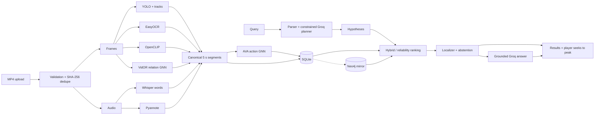

# VidQuery

VidQuery is an evidence-backed multimodal video search system. It turns an MP4
into timestamp-aligned evidence (speech, speakers, on-screen text, objects,
appearance, person actions, and subject-predicate-object relationships). Given
a natural-language query, it returns the moments that match, seeks to the exact
peak-evidence timestamp, and says how much the evidence can be trusted.

```text
Find where architecture is discussed
Find where SPEAKER_01 discusses deployment
Find a person near a laptop
Find the person in the blue jacket
Find a person talking to another person
find drive          <- ambiguous: the action, or the spoken word?
```

SQLite is the system of record and default search backend. Neo4j is an optional
graph mirror. Learned models run only from compatible, checksum-validated
checkpoints; random GNN weights are never used for inference.

## What it does

**Indexing.** Each upload is validated, deduplicated by SHA-256, split into
frames and audio, and passed through:

| Evidence | Model |
|---|---|
| Transcript with word timings | Whisper |
| Speaker turns | Pyannote 3.1 |
| Objects and short-range tracks | YOLOv8 |
| On-screen text | EasyOCR |
| Appearance descriptions | OpenCLIP ViT-B-32 |
| Geometry relations (`near`, `left_of`, `inside`, ...) | box geometry |
| Explicit relations (50 predicates) | VidOR pair-visual GATv2 |
| Person actions (80 labels) | AVA GATv2 |
| Semantic text vectors | MiniLM |

Everything is aligned into five-second canonical segments that keep every
underlying observation and its own timestamp.

**Search.** Search runs in two stages:

1. **Retrieve.** A local parser turns the query into a validated plan
   (entities, actions, relation tuples, speaker, spoken or OCR terms). The
   constrained Groq planner is consulted only for genuinely ambiguous queries.
   Segments are then ranked by lexical, semantic, entity, action, OCR,
   appearance, and exact relation-tuple evidence.
2. **Localize and assess** (Review-2).
   - **Localization.** Inside each winning segment, the localizer finds the
     peak-evidence moment (word, frame, or interval) instead of returning the
     segment start.
   - **Reliability.** Each result gets a reliability-weighted confidence and a
     `supported` / `weak` / `insufficient` verdict. Weak model output, such as
     the action GNN, cannot make a result look certain on its own.
   - **Hypotheses.** For ambiguous queries like `find drive`, each
     interpretation is retrieved separately. The system then either resolves
     the ambiguity or asks the user to pick one.
   - **Abstention.** When the evidence is insufficient, the response says so
     instead of returning a confident wrong timestamp.

**Answers.** Optionally, Groq writes a grounded answer from the top evidence,
citing only real result IDs and timestamps.


```mermaid
flowchart LR
    V[MP4 upload] --> I[Validation + SHA-256 dedupe]
    I --> F[Frames]
    I --> A[Audio]
    F --> YOLO[YOLO + tracks]
    F --> OCR[EasyOCR]
    F --> CLIP[OpenCLIP]
    F --> RGNN[VidOR relation GNN]
    A --> W[Whisper words]
    A --> P[Pyannote]
    YOLO --> C[Canonical 5 s segments]
    OCR --> C
    CLIP --> C
    RGNN --> C
    W --> C
    P --> C
    C --> AGNN[AVA action GNN]
    AGNN --> S[(SQLite)]
    C --> S
    S -.-> N[(Neo4j mirror)]
    Q[Query] --> PL[Parser + constrained Groq planner]
    PL --> H[Hypotheses]
    H --> R[Hybrid / reliability ranking]
    S --> R
    N --> R
    R --> L[Localizer + abstention]
    L --> UI[Results + player seeks to peak]
    L --> GR[Grounded Groq answer]
    GR --> UI
```

Groq never queries a database and never produces executable Cypher. If Groq is
unavailable, search still works.

## Quick start

Requirements: Python 3.11 or 3.12, FFmpeg/ffprobe, a Hugging Face token accepted
for Pyannote, and optionally a Groq API key and Docker (for Neo4j).

```bash
git clone https://github.com/0ri3nt/VidQuery.git
cd VidQuery
python3.12 -m venv .venv
source .venv/bin/activate            # Windows: .\.venv\Scripts\Activate.ps1
python -m pip install --upgrade pip
python -m pip install -e ".[dev,full]"
cp .env.example .env                 # Windows: Copy-Item .env.example .env
```

Put `HUGGINGFACE_TOKEN` and `GROQ_API_KEY` in `.env` (it is gitignored). For the
first run, set `ALLOW_MODEL_DOWNLOADS=true` and `HF_HUB_OFFLINE=0` so models can
be cached, then set them back.

```bash
python -m vidquery serve --host 127.0.0.1 --port 8000
```

Open <http://127.0.0.1:8000> (OpenAPI docs are at `/docs`), upload an MP4, and
search once it reaches `READY`. `GET /api/health` shows the readiness of every
model.

**[docs/SETUP.md](docs/SETUP.md)** has the exact model cache layout, how to
install the trained GNN checkpoints, and fixes for common problems (macOS SSL
certificate errors, Whisper on Apple Silicon, slow diarization, and a GNN that
produces no actions).

## Command line

| Command | Purpose |
|---|---|
| `serve` | run the API and browser UI |
| `process --video PATH --copy` | register and index one MP4 |
| `search "QUERY"` | search the local index |
| `refresh-library [--video-id ID]` | re-run current models on indexed videos |
| `diagnose-query "QUERY" [--video-id ID]` | trace why an action or relation query fails ([guide](docs/RETRIEVAL_DIAGNOSTICS.md)) |
| `evaluate` | run the Review-1 retrieval benchmark |
| `evaluate-challenge` | run the Review-2 timestamp and ambiguity benchmark |
| `backfill-gnn-actions` | apply the validated action GNN to stored evidence without reprocessing media |
| `import-ava`, `expand-ava-dataset` | import or expand the AVA evaluation and training corpus |
| `train-action-model`, `train-gnn-action-model` | train the action models |

All commands run as `python -m vidquery <command>`. Model changes do not rewrite
existing segments; use `refresh-library` or the Library tab's reprocess action.

## API

| Endpoint | Purpose |
|---|---|
| `POST /api/videos` | validate, stream, register, and queue an MP4 |
| `GET /api/videos` | list the video library |
| `GET /api/videos/{id}/status` | processing state, warnings, model provenance |
| `POST /api/videos/{id}/process` | reprocess (`409` while a job is running) |
| `POST /api/search` | ranked, localized evidence, with hypotheses, verdicts, and an optional grounded answer |
| `GET /api/videos/{id}/stream` | byte-range MP4 playback |
| `GET /api/videos/{id}/thumbnail` | nearest extracted frame |
| `GET /api/health` | SQLite, Neo4j, and per-model readiness |

Search accepts `ranking` (`hybrid` or `reliability`), `localize`,
`collapse_duplicate_evidence`, and `hypothesis_id`. The defaults reproduce
Review-1 behaviour; the UI turns on the full Review-2 behaviour. See
[docs/API.md](docs/API.md) and [docs/REVIEW2.md](docs/REVIEW2.md).

## Measured results

### Independent retrieval benchmark (Review-1)

62 manually specified queries over five videos (52 positive, 10 negative),
covering transcript, visual entity, spatial relation, AVA action, speaker,
multimodal, OCR, and negative categories. There is zero overlap with AVA
training or validation videos.

| Method | P@1 | P@5 | Recall@5 | MRR | Negative rejection |
|---|---:|---:|---:|---:|---:|
| Transcript lexical | 0.4231 | 0.0885 | 0.3462 | 0.4231 | 0.9000 |
| Transcript MiniLM | 0.5000 | 0.1885 | 0.4692 | 0.5000 | 0.3000 |
| Visual entity | 0.3462 | 0.3500 | 0.3617 | 0.4109 | 0.9000 |
| Hybrid without exact tuples | 0.9615 | 0.5692 | 0.7706 | 0.9615 | 0.9000 |
| Exact local hybrid | 0.9615 | 0.5769 | 0.7738 | 0.9615 | 0.9000 |
| Exact Neo4j graph | 0.8654 | 0.5462 | 0.6776 | 0.8654 | 1.0000 |
| AVA GNN-enhanced, supported 14-query subset | 0.5000 | 0.3714 | 0.2181 | 0.5000 | n/a |

These are capstone-scale results, not broad-domain claims. Details are in
[docs/EVALUATION_FINAL.md](docs/EVALUATION_FINAL.md).

### Learned models

| Model | Split | Supported macro F1 | Micro F1 | mAP |
|---|---|---:|---:|---:|
| AVA 80-label GATv2 v5 (active) | 3 held-out videos | 0.072086 | 0.462054 | 0.086745 |
| VidOR pair-visual GATv2 v2 (active) | 4 held-out videos | 0.178194 | 0.371113 | 0.191364 |

Both are weak on held-out data because of small test sets, label imbalance, and
domain shift. That is why Review-2 down-weights them rather than trusting them.
See [docs/GNN_STATUS.md](docs/GNN_STATUS.md).

### Review-2 challenge benchmark

The benchmark compares three systems on point-in-time ground truth: Review-1
(segment start as the answer), Review-1 plus localization, and full Review-2. It
measures timestamp error, temporal IoU, intent accuracy, negative rejection, and
confident-wrong rate. The code, schema, and tests are complete, and
`evaluation/queries_challenge.template.json` shows the manifest format. **No
annotated manifest has been checked in yet, so no Review-2 improvement is
claimed.**

## Development

```bash
python -m pytest -q          # 178 passed; 2 skip without live Neo4j or an optional checkpoint
python -m ruff check .
python -m mypy vidquery scripts
node --check frontend/assets/app.js
```

The Neo4j integration test skips when the service is unavailable. Groq tests use
mocks and do not consume API quota.

### Neo4j (optional)

```bash
export NEO4J_PASSWORD=choose-a-strong-local-password
docker compose up -d neo4j
docker compose up -d --build backend
```

Set `ENABLE_NEO4J=true` in `.env`, and send `"retrieval_backend": "neo4j"` to use
graph retrieval. See [docs/NEO4J_VERIFICATION.md](docs/NEO4J_VERIFICATION.md).

## Repository layout

```text
vidquery/       application: pipeline, models, retrieval, Review-2 layers, API, CLI
frontend/       browser UI
tests/          unit, API, model, and integration tests
scripts/        dataset preparation, training, evaluation, proof capture
evaluation/     query manifests and machine-readable results
database/       Neo4j schema and parameterized Cypher examples
demo/           controlled-demo manifest
docs/           documentation (index: docs/README.md)
extraction/, modelling/, core/, retrieval/, api/, app/
                original AVA research pipeline, kept for reproduction
```

`data/app/` (models, caches, uploads, extracted media, the SQLite database), raw
datasets, virtual environments, and `.env` are not versioned.

## Security and limitations

- Secrets live only in `.env`. `.env.example` contains no credentials.
- Neo4j queries are source-owned and parameterized. LLM output is never executed.
- Groq receives only bounded retrieved evidence. It cannot invent timestamps or
  fill in missing visual evidence.
- Uploads are size-bounded and probed, filenames are sanitized, and CORS is
  allowlisted. There is no authentication, so do not expose the service
  publicly.
- YOLO has a fixed class vocabulary, and OpenCLIP is similarity evidence, not
  open-vocabulary detection. Speaker IDs are per-file clusters, not identities.
  Tracking is short-range only.
- Confidence values and verdicts are reliability-weighted design constants, not
  calibrated probabilities.

See [docs/MODEL_LIMITATIONS.md](docs/MODEL_LIMITATIONS.md) and
[docs/FINAL_CAPSTONE_EVIDENCE.md](docs/FINAL_CAPSTONE_EVIDENCE.md) for what can
and cannot be claimed.

## Documentation

The full index is [docs/README.md](docs/README.md). Key documents:

- [Setup and troubleshooting](docs/SETUP.md)
- [Architecture](docs/ARCHITECTURE.md)
- [Review-2 design](docs/REVIEW2.md)
- [API contract](docs/API.md)
- [Retrieval diagnostics](docs/RETRIEVAL_DIAGNOSTICS.md)
- [GNN status](docs/GNN_STATUS.md)
- [Final evaluation](docs/EVALUATION_FINAL.md)
- [Final demo guide](docs/FINAL_DEMO_GUIDE.md)
