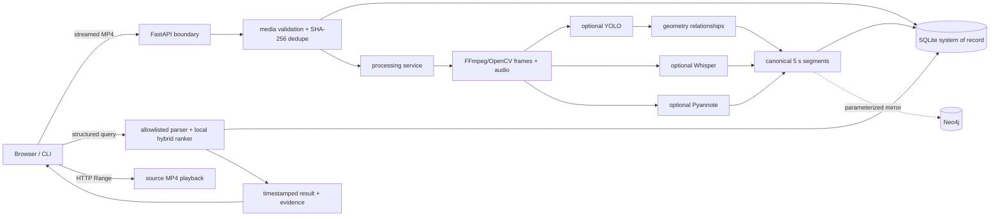

# Architecture

## Delivered vertical slice



The API starts without importing Torch, YOLO, Whisper, Pyannote, or Neo4j. Optional adapters load on first use. SQLite owns video registration, processing state, warnings, and canonical segment JSON. This makes uploads and search survive process restarts even when Neo4j is disabled or unavailable.

## Processing lifecycle

```text
UPLOADED
  -> PREPROCESSING
  -> VISUAL_PROCESSING
  -> AUDIO_PROCESSING
  -> SCENE_GRAPH_GENERATION
  -> ALIGNING
  -> INDEXING
  -> READY
                   \-> FAILED (stage + safe message + private traceback)
```

The service samples frames at `FRAME_SAMPLE_RATE`, extracts mono 16 kHz audio, assigns detections/transcripts/speakers/relationships to fixed-duration windows, writes all windows transactionally, then mirrors them to Neo4j when configured. Optional visual/audio/diarization exceptions add warnings; invalid media, no readable frames, or persistence failures stop the job.

## Component boundaries

| Boundary | Responsibility | Failure behavior |
|---|---|---|
| `VideoIngestionService` | streamed size limit, safe name, MP4 signature/probe, metadata, content hash | rejects with 413/415; partial upload removed |
| `VideoProcessingService` | state machine and orchestration | optional models degrade; core failure persists `FAILED` |
| Model protocols/adapters | detections, timed transcript, speaker turns | lazy imports and explicit unavailable warnings |
| Canonical segment builder | timestamp alignment and evidence envelope | deterministic IDs/windows |
| `SQLiteRepository` | persistent registry and canonical payloads | transaction rollback on failed write |
| `CanonicalNeo4jIndexer` | idempotent graph mirror | warning; local READY/search remains available |
| `StructuredQueryParser` | local aliases, morphology, speech/OCR cues, and allowlisted NL-to-plan mapping | clear queries remain local |
| `QueryPlanningService` | optional constrained Groq planning over vocabularies only | ambiguous queries validate strictly; failures use safe local plans |
| `LocalHybridSearchEngine` | validated structured constraints plus transparent lexical/semantic score | zero score means omitted; no arbitrary execution |
| Browser frontend | upload, state, search, evidence, seeked playback | visible empty/error states |

## Trust boundaries and security

External bytes cross only the upload endpoint. The server selects storage paths and writes chunks with a hard byte ceiling. FFmpeg/OpenCV receive argument lists, not shell strings. Query text is parsed into a fixed `QueryPlan`; ambiguous text may be classified by Groq only against supplied allowlists and a strict schema. Groq never receives storage access. The only Cypher compiler owns a static statement and binds validated values as parameters. Legacy Groq-to-Cypher execution was replaced with a safe wrapper.

The current service intentionally has no authentication. Deploying beyond a trusted environment requires identity, per-video authorization, request/rate quotas, malware scanning, object storage, TLS, worker isolation, and a migration-managed database.

## Legacy and migration

The original AVA workflow remains under `extraction/`, `core/`, `modelling/`, `database/graph_builder.py`, and `main.py`. `vidquery/ava_adapter.py` reads fused JSON and converts it to canonical segments without overwriting the corpus. Legacy graph labels stay in `database/schema.cypher` for readability, while the application writes the segment-centered schema.

## Scaling path

For a production scale-out, replace in-process background tasks with a durable queue, move MP4/frames to object storage, migrate SQLite to a transactional service, use an approximate-nearest-neighbor index for learned embeddings, partition extraction workers by GPU need, and add OpenTelemetry plus stage metrics. These are extensions of the existing boundaries rather than rewrites of the domain contract.
