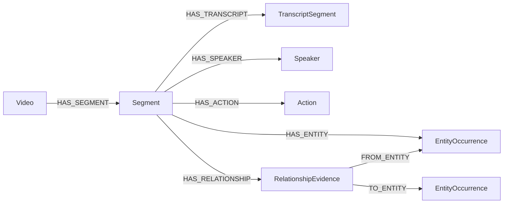

# Graph schema

Neo4j is an optional, rebuildable mirror of canonical SQLite segments. All identities are application-generated, writes use `MERGE`/`UNWIND` with parameters, and re-ingesting the same video is idempotent for canonical nodes and edges.

## Canonical nodes

| Label | Identity | Principal properties |
|---|---|---|
| `Video` | `video_id` | display name, server path, duration, dimensions, fps, audio flag, state |
| `Segment` | `segment_id` | video ID, start/end seconds, aligned transcript |
| `EntityOccurrence` | `detection_id` | frame ID, timestamp, class ID/label, confidence, pixel and normalized boxes |
| `TranscriptSegment` | `transcript_segment_id` | start/end, text, confidence, assigned speaker |
| `Speaker` | `speaker_key = video_id:label` | video ID and diarization label |
| `Action` | `name` | canonical/mapped action name |
| `RelationshipEvidence` | `relationship_id` | source/target detection IDs, predicate, confidence, source method, timestamp |

Relationship evidence is modeled as a node because provenance belongs to an observation, not to a permanent edge between object classes. `FROM_ENTITY` and `TO_ENTITY` are only created when the referenced detections exist.

## Constraints and indexes

`database/schema.cypher` defines uniqueness for every canonical identity and indexes segment time, occurrence class, and relationship predicate. It also retains the original Phase 1 labels (`Frame`, `Scene`, `Object`, `Person`, `Concept`, `AudioSegment`) so old graphs can still be inspected; the canonical application does not write new data into that legacy shape.

## Query contract

`SafeCypherCompiler` accepts only `QueryPlan` values (`visual_entities`, `actions`, `relationships`, exact `relationship_tuples`, `spoken_terms`, `speaker`, video IDs, limit) and binds them to a source-owned static statement. Exact tuples traverse `FROM_ENTITY` and `TO_ENTITY`; only predicates declared symmetric permit endpoint reversal. It returns segment timestamps and the matching relationship tuple. It never interpolates query text and never executes generated Cypher. The local SQLite ranker remains the default search implementation; `retrieval_backend: "neo4j"` activates graph filtering followed by canonical SQLite hydration and ranking.

## Migration notes

Schema creation currently uses idempotent Cypher rather than a numbered migration system. Before multi-environment production deployment, introduce migration versions, remove `stored_path` from the graph or replace it with an object-store key, add tenancy/authorization properties, and provide stale-node cleanup for evidence removed by reprocessing.
